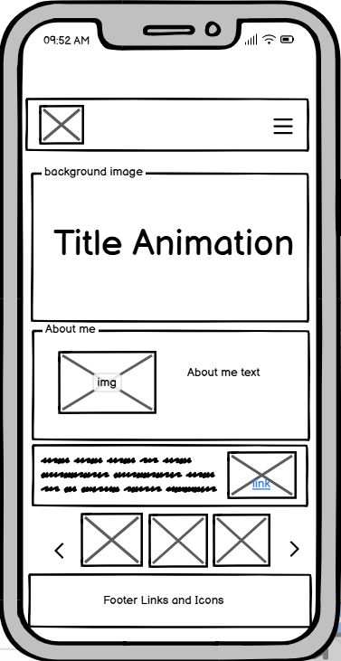
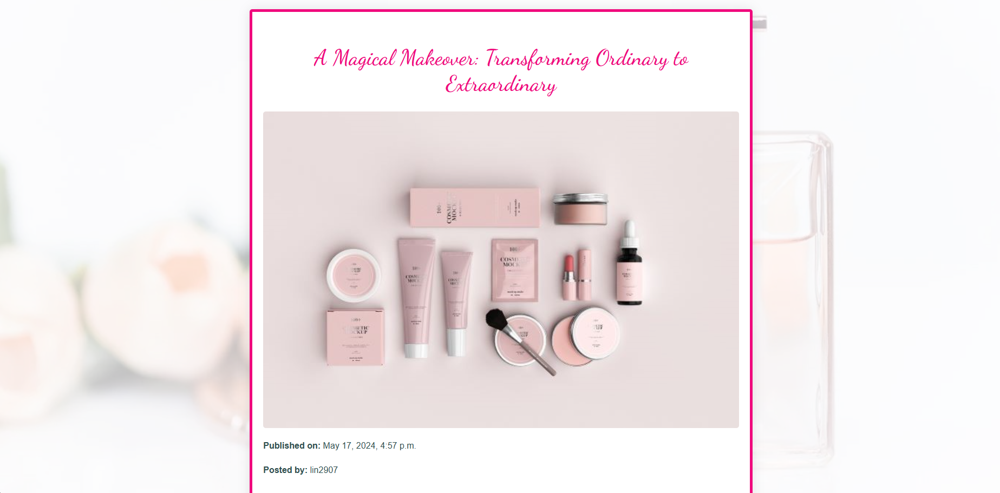

# Ciao Bella Blog

### Overview
Ciao Bella Blog is a Django-based web application that offers a modern and user-friendly platform for cosmetic tips and products.
 
It includes a homepage with an about section, restaurant recommendation, a product gallery, and an entertaining quiz. 

Additionally, the blog features skincare and product articles , allowing users to read, comment, like, and interact with the content once logged in.

Responsivness images

Live Site can be found [here.](https://ciao-bella-blog-52e670d348e8.herokuapp.com/)

## Table of Contents
- [User Experience](#user-experience)
- [Design](#design)
- [Wireframes](#wireframes)
- [Database Design](#database-design)
- [Features](#features)
- [Languages and Technologies](#languages-and-technologies)
- [Packages](#packages)
- [Tools and Programs Used](#tools-and-programs-used)
- [Testing](#testing)
- [Code Validation](#testing)
- [Manual Testing](#manual-testing-need-to-do-a-separate-file)
- [Deployment](#deployment)
- [Content](#content)
- [Credits](#credits)

## User Experience

### User Stories

  + As a User I can browse the blog and read articles without signing in so that I can explore content freely
  + As a User I can see a clear option to sign up for an account so that I can access additional features of the blog like commenting and liking articles
  + As a logged in User I can leave comments on a post so that I can share my thoughts and engage with other users.
  + As a Site User / Admin I can view comments on an individual post so that I can read the conversation.
  + As a logged in User I can edit or delete my comments so that I can be involved in the conversation.
  + As a Site User I can like the articles so that I can show appreciation for content that I enjoy.

### Site Admin
  + As a Site Admin I can create, read, update and delete posts so that I can manage my blog content .

## Design

### Color Scheme

#### Primary Colors
  + Dark Washed Rose: `rgb(214, 10, 112)`
  + White 

  

## Wireframes

### Desktop

Home Page  
  
Blog Page  
  
Register Page  
  
Log in Page  
  
404 Error page  
  

### Mobile

Home Page  
  
Blog Page  
  
Blog detail and comment Page  
  
Server error Page  
  
404 Error page  
  

### Typography

Font used : Dancing Script - gives feminine elegance with its cursive strokes adding a touch of charm and sophistication. 

## Database Design
ERD - Entity Relationship Diagram

### Models

#### Blog Post Model

The blog post model is the central model for the entire application.  
Each blog post features essential details like the title, author, content, published date, and a featured image.  
Additionally, posts can include optional attributes: ingredients, how to use, and benefits.

#### User Model
The User model is Django's built model,used for authentication purposes.

#### Comment Model

The Comment model is used to store all of the comments created by the users. It is linked to the Blog Post model so that the comments are correctly aligned with the related blog post.

#### Liked post Model

The Liked post model is created for the purpose of adding a like feature to the posts, where User can express their preferences by liking or unliking blog posts.

## Agile Development

### Project Board

  + MoSCoW

For this project the MoSCoW technique, (Must have, Should have, Could have, Won't have) was essential for planning out the User Stories. 

  + Kanban

To help visualise the project and plan accordingly with a schedule the Kanban system is used - implemented through GitHub Projects.

## Features

 ### Navbar

  + The navbar is created using Bootstrap 5 in order to ensure it would be responsive across various viewports. 

   + When a user is not signed in the navbar will display the following:

  

  + When the user is signed in the following is instead displayed:

  

   + Navbar Mobile expanded
  
  

### Footer

The footer for this application is containing links to various social media platforms, the navigation and search option.

### Home Page

#### Landing page hero image 

#### About me Section

 

#### Gallery Section

The gallery showcases a random selection of images  that highlight the topic of blog posts.

 

### Blog Page - Skincare

The blog posts page includes search option making it simple for User to find and explore content.  

 

For better user experience and readability , the posts are spread on more then one page (pagination included).  

 

### Post Details Page

 

#### Comments Section

 

#### Like post 

 

#### Optional attributes

 

### Sign Up
From here if the user does not have an account they may register their account.

 

### Log In
 

### Log Out

 

## Languages and Technologies

+ HTML was used for the markup and templating.
+ Django as the web framework.
+ Python was used for all backend work.
+ CSS was used to style the site.
+ JavaScript and JQuery were used for managing random products gallery on home page and updating comments.
+ Bootstrap 5 was used throughout some elements for a responsive framework.

## Packages

The following packages were installed throughout the development:

+ Crispy-bootsrap5	- This package was used to create a reusable DRY approach to forms. 
+ Django-allAuth  - This package was used to provide templates, views and models necessary for user authentication. 
+ Summernote  - This was used to allow for a more creative approach when posting to the database through a custom model   so the text fields can have various font and layout styling added to them. 
+ Whitenoise- This was used to allow the app to serve it's own static files needed for deployment.

## Tools and Programs Used
+ [GitPod](https://gitpod.io/workspaces) was used as the main IDE for the project. 
+ [GitHub](https://github.com/) for hosting the repository.
+ [Heroku](https://id.heroku.com/login) was used for deployment.
+ [FontAwesome](https://fontawesome.com/) for providing all icons used throughout the site.
+ [Smartdraw](https://app.smartdraw.com/editor.aspx?credID=-61278721&depoId=55466879&flags=128) for creating the database ERD.
+ [AmIResponsive](https://ui.dev/amiresponsive) for creating the README header image.
+ [Favicon.io](https://favicon.io/) for creating a favicon.
+ [Figma](https://www.figma.com/) and [Balsamiq](https://balsamiq.com/) for creating the wireframes.

## Testing
### Code Validation
  + Lighthouse

The pages for are tested using Google-Lighthouse.

# Validation

## CSS Validation
For CSS validation [W3C-CSS-Validator](https://jigsaw.w3.org/css-validator/validator) was used.

## HTML Validation
HTML markup was validated using [W3C-HTML Validator](https://validator.w3.org/nu/#textarea)

 + Home page

 + Blog Posts page

 

 + Search Page

 

 + Detailed post page

 

Note : Embedded styles are applied due to not showing on site when added in style.css - rest of the errors appear to be caused by Bootstrap and Summernote. Duplicate ID's are caused by different comments added .

# JavaScript Validation
JSHINT was used to validate the comment script.

# Python Validation
All of the Python files were validated using PEP8 with CI-Python-Linter

# Manual Testing (need to do a separate file)
Full testing of the functionality of the site was done on the following devices:

Laptop Used : Samsung Galaxy Book2 Pro 360 Notebook
Mobile : iPhone 11

The following browsers were used to test the functionality of the site.

  + Microsoft Edge , Safari

# Deployment

For this project the application was deployed to Heroku using the following steps:

 + Log into my Heroku account and navigate to the dashboard.
 + Click on 'New' to create a new app. Set region to EU, click on 'Create app'.
 + In the 'Settings' tab in 'Reveal Config Vars' add the  environment variables for the Database, Secret Key and CollecStatic.
 + Navigate to the 'Deploy' tab and under 'Deployment Method' click on 'GitHub'.
 + Locate the repository from GitHub, paste the link and click 'Connect'.
 + Ensure that the selected branch is 'main branch' before clicking to Deploy.
 + Once the build is finished there should be a message saying 'Your app was successfully deployed' with a 'View' button.

# Credits
  ### Content
 + Images were taken from Pixabey.
 + Blog posts were generated with Chat Gpt.
 + Django and Bootstrap official Documentation, W3 Schools, Code Institute Walkthrough Project.
 
 I would like to say special thanks to my mentor Mitko for helping and supporting me througough this and all previous projects.

 Happy Coding !!!
