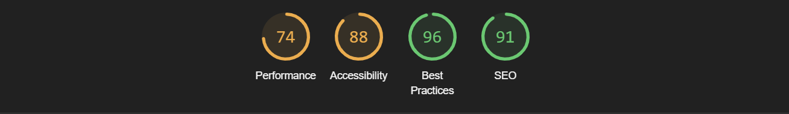
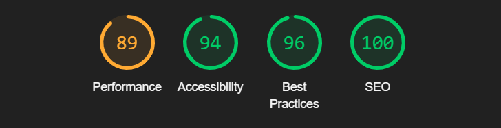
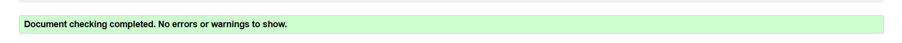
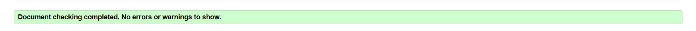
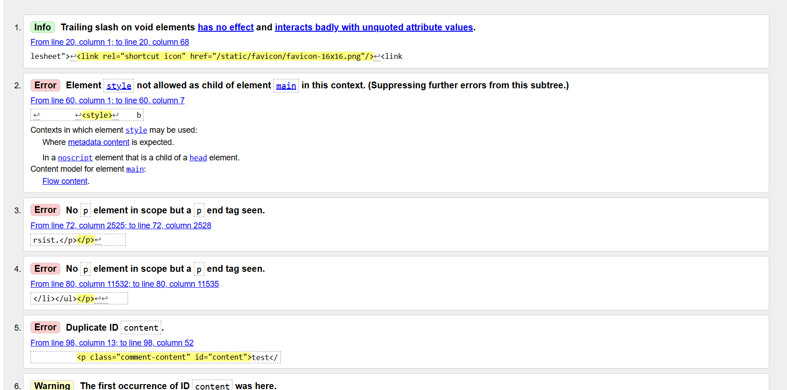

# Testing

### Code Validation
  + Lighthouse

The pages for are tested using Google-Lighthouse.

## Validation

### CSS Validation
For CSS validation [W3C-CSS-Validator](https://jigsaw.w3.org/css-validator/validator) was used.

### HTML Validation
HTML markup was validated using [W3C-HTML Validator](https://validator.w3.org/nu/#textarea)

 + Home page

 + Blog Posts page

 

 + Search Page

 

 + Detailed post page

 

Note : Embedded styles are applied due to Bootstrap override not showing on site when added in style.css - rest of the errors appear to be caused by Bootstrap and Summernote. Duplicate ID's are caused by different comments added .

### JavaScript Validation
[JSHINT](https://jshint.com/) was used to validate Javascript files.

### Python Validation
Python files were validated using PEP8 [CI-Python-Linter](https://pep8ci.herokuapp.com/)

## Manual Testing
Full testing of the functionality of the site was done on the following devices:

+ Laptop Used : Samsung Galaxy Book2 Pro 360 Notebook
+ Mobile : iPhone 11

The following browsers were used to test the functionality of the site.

  + Microsoft Edge , Safari

| Feature                                 | Expected Result                                                                                                                                                                                        | Steps Taken                                                                          | Actual Result                                                    |
| --------------------------------------- | ------------------------------------------------------------------------------------------------------------------------------------------------------------------------------------------------------ | ------------------------------------------------------------------------------------ | ---------------------------------------------------------------- |
| Navigation                              |                                                                                                                                                                                                        |                                                                                      |                                                                  |
| Home Page Link                          | When the link is clicked it should direct the user to the 'Home' page                                                                                                                                  | Click on 'Home' text on navbar                                                       | Redirects to 'Home' Page                                         |
| Logo Link                               | When the link is clicked it should direct the user to the 'Home' page                                                                                                                                  | Click on 'Logo icon' on navbar                                                       | Redirects to 'Home' Page                                         |
| Skincare Link                           | When the link is clicked it should direct the user to the 'Skincare' page (Blog posts)                                                                                                                 | Click on 'Skincare' on navbar                                                        | Redirects to 'Skincare' Page                                     |
| Register Page Link                      | When the link is clicked it should direct the user to the 'Sign Up' page                                                                                                                               | Click on 'Register' on navbar                                                        | Redirects to 'Sign Up' Page                                      |
| Sign In Page Link                       | When the link is clicked it should direct the user to the 'Sign In' page                                                                                                                               | Click on 'Log in' on navbar                                                          | Redirects to 'Sign In' Page                                      |
| Sign Out Page Link                      | When a user is logged in, it should direct the user to the 'Sign Out' page                                                                                                                             | Click on 'Logout' on navbar                                                          | Redirects to 'Sign Out' Page                                     |
| Footer                                  |                                                                                                                                                                                                        |                                                                                      |                                                                  |
| Instagram Link                          | When the link is clicked it open a link to Instagram in a new tab                                                                                                                                      | Click on 'Instagram' icon                                                            | A new tab opens and directs to Instagram                         |
| YouTube Link                            | When the link is clicked it open a link to YouTube in a new tab                                                                                                                                        | Click on 'YouTube' icon                                                              | A new tab opens and directs to YouTube                           |
| Twitter Link                            | When the link is clicked it open a link to Twitter in a new tab                                                                                                                                        | Click on 'Twitter' icon                                                              | A new tab opens and directs to Twitter                           |
| Facebook Link                           | When the link is clicked it open a link to Facebook in a new tab                                                                                                                                       | Click on 'Facebook' icon                                                             | A new tab opens and directs to Facebook                          |
| Search button                           | When the button is clicked it open a Search results page                                                                                                                                               | Click on 'Search' button                                                             | A Search results page opens                                      |
| Search text area                        | When the text is entered it opens a Searched results page                                                                                                                                              | Enter Text in Search area                                                            | A Searched results page opens                                    |
| Home Page Link                          | When the link is clicked it should direct the user to the 'Home' page                                                                                                                                  | Click on 'Home' text on footer                                                       | Redirects to 'Home' Page                                         |
| Skincare Link                           | When the link is clicked it should direct the user to the 'Skincare' page (Blog posts)                                                                                                                 | Click on 'Skincare' on footer                                                        | Redirects to 'Skincare' Page                                     |
| Sign In Page Link                       | When the link is clicked it should direct the user to the 'Sign In' page                                                                                                                               | Click on 'Log in' on footer                                                          | Redirects to 'Sign In' Page                                      |
| Home Page                               |                                                                                                                                                                                                        |                                                                                      |                                                                  |
| All information loads                   | The user should see a logo, background image title animation, about me section, restaurant rec. , randomly displayed product gallery leading to detailed blog posts, and option to play the quiz | Navigate to Home page                                                                | All information is displayed correctly                           |
| Gallery                                 | Six product images should be randomly displayed to the user on each refresh , when clicked directs to Detailed post page                                                                            | Refresh the page and the featured images should change                            | Tested by refreshing the images displayed change              |
| Restaurant recommendation            | When clicked on image, the restaurant website should open in new tab                                                                                                                                   | Click on image                                                                       | Opens 'Restaurant Simphony' in new tab                           |
| Quiz section                            | When clicked on button, the quiz should open in new tab                                                                                                                                                | Click on button                                                                      | Opens 'Quiz' in new tab                                          |
| Skincare Page                           |                                                                                                                                                                                                        |                                                                                      |                                                                  |
| Post List                               | All of the posts within the database should be displayed in a 2 column list , 6 posts per page, showing the image and a teaser for the recipe , next and previous button                         | Scroll through all posts and ensure that each image and post information matches up. | All posts match and are displayed as expected                    |
| Search Bar                              | User should be able to search and filter for one or more posts when using the search bar                                                                                                            | Enter 'Eye care' into the Search Bar                                                 | Search Result page is displayed showing 'Prioritize Eye Care' |
| Full Blog Post                          | When clicking on a post title the user should be brought to that post's page.                                                                                                                          | Click on one of the posts                                                            | Full blog post is displayed as expected                          |
| Blog Post Detail Page                   |                                                                                                                                                                                                        |                                                                                      |                                                                  |
| View Post                               | When on detailed post page the correct image should be displayed along with the optional post information                                                                                           | Open one of the posts                                                                | All of the information is displaying correctly                   |
| Logged in user can comment on a post | When a user is logged in they can add a comment on a blog post                                                                                                                                         | Registred as user commented                                                          | Comment is displayed on related post                             |
| User can edit their comment          | When logged in User is able to edit their comment                                                                                                                                                      | Click on Edit comment , edit content and update                                   | Comment is editing correctly                                     |
| User can delete their comment        | When logged in User can delete their comment                                                                                                                                                           | Click on Delete comment message to User 'Comment is deleted'                      | Comment is deleted correctly                                     |
| User can Like/ Unlike the post       | When logged in User can Like or (if previously liked) Unlike the post                                                                                                                                  | Click on Like , message 'Post liked' Click on Unlike, message 'Post unliked'      | Like/Unlike option displays correctly                            |
| Sign Up Page                            |                                                                                                                                                                                                        |                                                                                      |                                                                  |
| User can create an account           | Once they have clicked on the Register link and are brought to sign up page                                                                                                                            | Registered to create user                                                            | User account is created                                          |
| Sign In Page                            |                                                                                                                                                                                                        |                                                                                      |                                                                  |
| User can sign in to their account    | Once the Login link is clicked the user can sign in to their account                                                                                                                                   | Logged in as registred User                                                          | Log in functions correctly                                       |
| Sign Out Page                           |                                                                                                                                                                                                        |                                                                                      |                                                                  |
| User can sign out of their account   | Once logged in, User have an option to Log Out of their account                                                                                                                                        | Logged out of the User Account                                                       | Log out functions correctly                                      |

## Bugs

